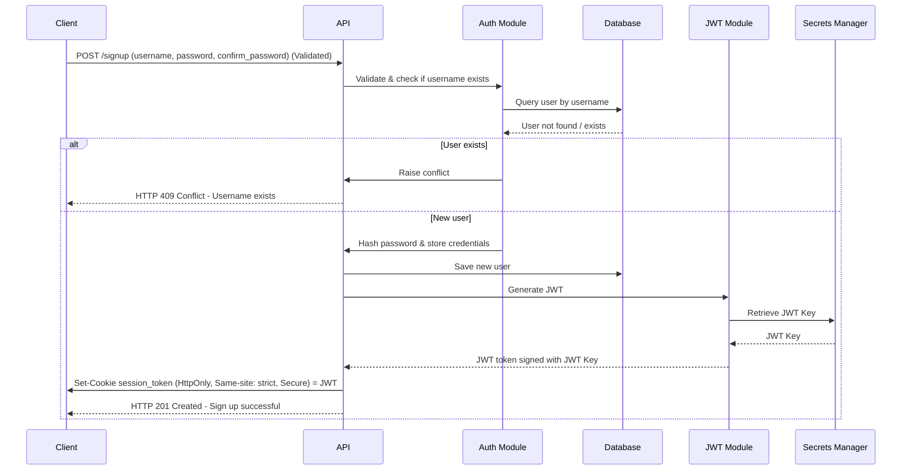
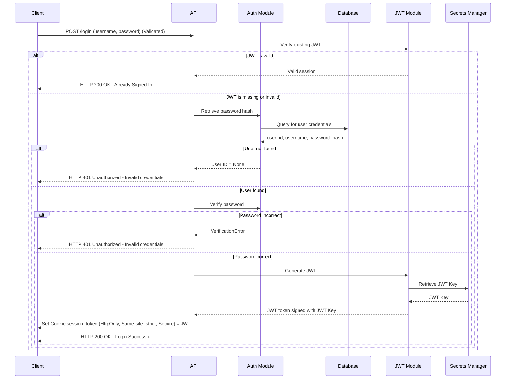
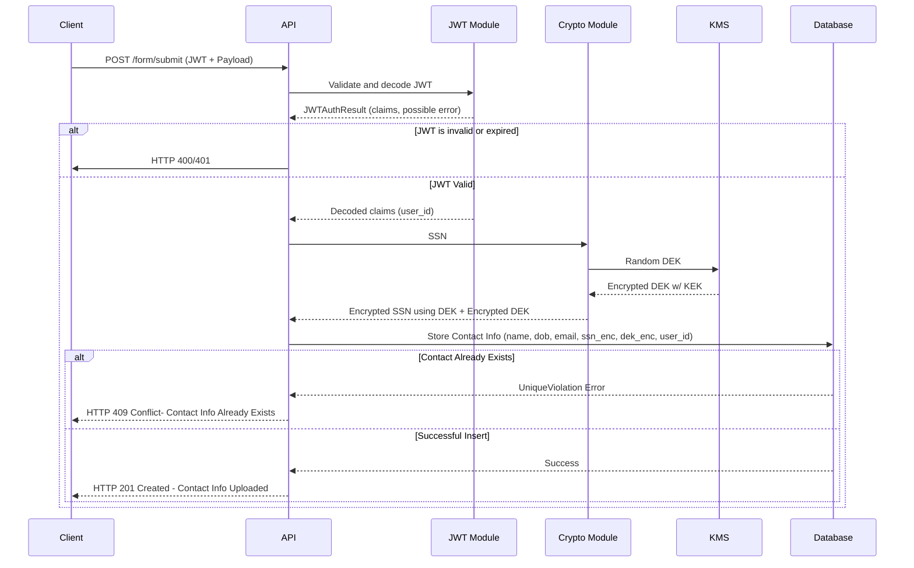
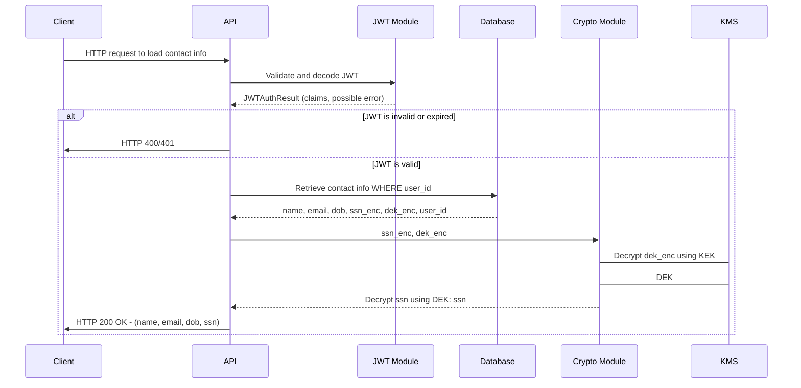

# Introduction

This is the repo for Yam Ke Li's submission for MoneyLion's Security Engineer's Test which task is to build a simple app that collects users' sensitive contact information after authentication. The app is build using Vanilla HTML, CSS, JS for the frontend, Python FastAPI for the backend and PostgreSQL for the database. The entire is stack is deployed on AWS using EC2 and RDS as the main infrastructure with Secrets Manager for credentials and KMS for cryptography. This report will detail my process of building the app from requirements gathering, desgining, threat modelling, mitigation, building to deployment.

# Requirements Gathering

The main use cases as defined in the question includes: User authentication and User contact information storage. From these two, I have expanded also user sign up and contact information loading after authentication.

## User Sign Up

This use case involves a new user signing up to the app by creating an account with a username and a password. The functional requirements identified are as followed\:

1. User must provide valid username and valid password to create an account.
2. Existing username should not rejected.
3. Inputs from user should be validated against a defined format.
4. Usernames should contain only alphanumericals and underscore (\_) and dashes (-).
5. User password must be hashed at storage and verifiable at subsequent logins.

## User Log In

This use case involves users who has created accounts logging into the app with said credentials. The requirements identified are as follows\:

1. User must provide valid username and valid password registered to login.
2. System verifies submitted username and hash of submitted password against hash of stored password to verify password correctness.
3. System signs and returns a JWT valid for 1 hour to authenticate user activities in the validity period.

## User Uploads Contact Information

This use case involves users who has logged in and authenticated uploading their contact information with the fields [name, email, date of birth, social security number]. The requirements identified are as follows\:

1. User must be authencticated.
2. User information is based on the signed JWT payload which the backend should verify by comparing signatures.
3. Contact info linked to User ID.
4. Sensitive info (SSN) must be encrypted at rest.

## User Loads Contact Information

This use case involves users who has uploaded their contact information to load their information and view them. The requirements identified are as follows\:

1. User must be authenticated.
2. User must only view their own contact information.
3. SSN should be decrypted from DB.

# Solution Designing

In this stage, I planned and designed the process flow and logic of each endpoint serving each use case. After the initial design, I performed threat modelling find possible risks and entry points and analyse the findings below.

## User Sign Up

## User Log In

## User Uploads Contact Information

## User Loads Contact Information

## Threat Modelling

### STRIDE

| Threat                 | Risk                                                     | Mitigation                                                                 | Incl. |
| ---------------------- | -------------------------------------------------------- | -------------------------------------------------------------------------- | ----- |
| Spoofing               | JWT Forgery                                              | Use HS256 with keys in Secrets Manager to sign JWT                         | ✅    |
|                        | JWT Theft using XSS                                      | Secure JWT in HttpOnly, SameSite and Secure cookie                         | ✅    |
|                        | JWT Replay                                               | Short expiry with refresh strategy, invalidation after discard             | 0.5   |
| Tampering              | JWT Tampering                                            | Check signature of JWT before using claims                                 | ✅    |
|                        | XSS Injection                                            | Sanitize user inputs before HTML rendering, use strong CSP, ban inline-JS  | ✅    |
|                        | SQL Injection                                            | Sanitize inputs and use parameterised queries                              | ✅    |
| Repudiation            | User denial of actions                                   | Verbose logging with user ID, IP and timestamp                             | ✅    |
| Information Disclosure | Database breach leaking sensitive info (SSN, password)   | Implement encryption strategy for data at-rest and hashing for credentials | ✅    |
|                        | Overly verbose response behaviour (error, response time) | Obfuscate and consolidate error messages                                   | ✅    |
| Denial of Service      | Endpoint flooding                                        | Rate limiting                                                              | 0.5   |
|                        | Large payload size                                       | Limit size or length of payload size                                       | ✅    |
| Elevation of Privilege | Broken access control, allowing cross user data access   | Derive user_id from verified JWT                                           | ✅    |

## Summary of Security Measures Included

### Frontend

1. Input validation and sanitization
2. Content Security Policy (CSP) prohibiting the injection of unauthorized JS sources and inline JS
3. Use of signed HttpOnly cookies for sensitive tokens (CSRF Protection)

### Backend

1. Input validation and sanitization before request logic
2. Use of parameterised queries to prevent SQL injection
3. Hashing of Passwords using Argon2ID (time_cost=3, memory_cost=12288, parallelism=1) following [OWASP Recommendation](https://cheatsheetseries.owasp.org/cheatsheets/Password_Storage_Cheat_Sheet.html#argon2id)
4. Storing only the hash of password
5. Using HS256 to sign JWT tokens after authentication to maintain session
6. Management of JWT key using AWS Secrets Manager
7. Only trust JWT claims (user_id) if it passes verification
8. Algorithm allowed at verification is not dependent on header to prevent "alg": "none" attacks
9. Relatively short (1 hour) lifetime for JWT
10. Obfuscated error message (same for both user not found and wrong password)
11. SSN encryption at rest
12. Use of envelope encryption [^1] [^2] where unique data encrypting keys (DEK) are used to encrypt individual data while a secured key encrypting key (KEK) stored on AWS KMS is used to wrap the DEKs

[^1]: [OWASP Cryptographic Storage](https://cheatsheetseries.owasp.org/cheatsheets/Cryptographic_Storage_Cheat_Sheet.html#encrypting-stored-keys)
[^2]: [Google Envelope Encryption](https://cloud.google.com/kms/docs/envelope-encryption)

### Limitations

Due to the need to limit the scope of this assesment project, there are multiple risks identified, but not mitigated or partially mitigated.

**JWT Invalidation**
The app, as designed, is fully stateless where users' session states are not stored or tracked in anyway. This poses a challenge when we try to log out. As JWTs are assigned an expiry time and is signed to validate the authenticity of this claim, without some JWT state tracking, it is impossible to prematurely invalidate the JWT.
Production systems typically use a combination of Access Token with a very short validity (15 minutes) and a Refresh Token with a longer life that will be used to refresh or reissue an access token. In the case of log out, we maintain the state of refresh tokens and invalid them at a log out request.

**Rate Limiting**
Current implmentation of rate limiting is confined to the network layer where IP based blocking is used in the reverse proxy. A more comprehensive implementation of rate limiting would include an application layer check as well, typically on the logged in user. However, as mentioned above, the application now is fully stateless and there is no way to track past user activity and rate limit against that.

# Development

Once the overall flow and logic for each endpoint is decided, I started the development process.

## Project Directory

This project uses a monorepo strategy that contains the frontend, backend as well as the Nginx configuration.

## Git Strategy

The git branching strategy used in this project largely follows the GitFlow strategy where two long-running branches are maintained (main and development) and each feature is a separate branch with a prefix feature/[feature-name].

# Testing

Testing is done after each feature is built and before the branch is merged. The testing process utilises pytest to write the different test cases. Test cases are separated into two types: unit testing and API testing.

Unit testing involves testing certain specific function or logic of the larger feature (e.g. testing whether encrypted data can be decrypted).

API testing is to test the behavior and the response of the API endpoints to ensure the correct response is given given a scenario (e.g. /auth/login should return a HTTP code of 401 if user fails to be authenticated).

# Deployment

The app is currently deployed publicly on https://ml-contact-yam.oscore.my

## Architecture

The app is being deployed on AWS with Cloudflare being the CDN and DNS and first proxy to provide services like WAP before hitting my infrastructure. The main compute is an EC2 isntance running a Docker Swarm of Nginx and FastAPI containers. The Nginx serves as my reverse proxy and webserver combo where static frontend files are being served, the FastAPI is my main backend service, exposing 4 endpoints. The database used is a PostgreSQL managed by RDS. I also use both Secrets Manager and KMS to manage credentials and keys.

